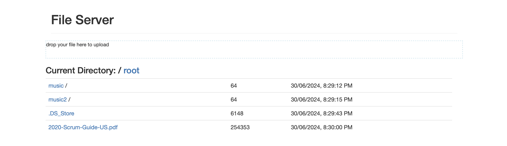

# File Server
A Simple file transfer http server to provide file downloads/uploads at local filesystem. It focuses on providing simpler operations to download/upload file, such as by uploading them to server by dragging files to the webapp.

**Screenshot**:


## Build

Build the Spring Boot application with Maven.

```sh
mvn package
```

It outputs a `.jar` file (fileserver-x.x.x-SNAPSHOT.jar) at the `target/` folder.

## Configure

Configure the file `src/main/resources/application.properties` for customizing the application.

The values used in the source folder are as follows:
```conf
server.address=localhost
server.port=8080
spring.servlet.multipart.max-file-size=10MB
spring.servlet.multipart.max-request-size=10MB
```

## Run 

Prepare the file organization as follows:

```
root/
src/
  main/
    webapp/
      resources/
        (..)
fileserver-x.x.x-SNAPSHOT.jar
```

The folder `src/main/webapp/resources/` are the content for serving frontend web page. They include some JS files which are external libraries (Bootstrap, JQuery, ReactJS, BabelJS) (pre)downloaded via CDN. 

The folder `root/` is the destination for storing the files uploaded from the file server. 

Run the java application,

```sh
java -jar fileserver-x.x.x-SNAPSHOT.jar
```
